# OnePlus 6T Arch Linux ARM Installer

Turn a bootloader-unlocked OnePlus 6T, codename `fajita`, into a bootable
Arch Linux ARM phone image with a Hyprland touch shell, mobile networking,
phone/SMS userspace, audio routing, sensors, Bluetooth, haptics, and a
reproducible fastboot install path.


This sponsored development repository is the feature-forward OnePlus 6T line.
It carries the current installer work, the richer phone UX overlay, the full
userdata/Btrfs image path, the package picker, the first-boot account/network
prompts, phone/SMS/audio helpers, rotation/input work, and the sponsor-preview
phone shell.

This project is not a generic rootfs tarball. It builds a matched OnePlus 6T
boot/root image pair, checks the attached phone's real userdata size, verifies
large release inputs, lets the installer user review packages and first-boot
settings, then flashes only after an explicit destructive confirmation.

The build produces:

```text
oneplus6t-arch-boot.img
oneplus6t-arch-root.img
```

Those two files are a pair. The boot image tells the PMOS SDM845 initramfs
where the Arch Linux ARM Btrfs root lives; the root image contains the phone UI,
hardware services, packages, helper scripts, and profile overlay.

## Copy/Paste Install

If the OnePlus 6T bootloader is already unlocked and the phone is already in
fastboot mode, the shortest install path is:

```sh
git clone https://github.com/ToniMcQueen/oneplus6t-install-linux-Arch-on-arm-845.git
cd oneplus6t-install-linux-Arch-on-arm-845/
./oneplus6t-install
```

The installer still stops before the destructive flash and asks you to type
`FLASH`. Nothing is written to the phone until that final confirmation.

## What You Get

This is a practical Linux-phone preview for people who want to test real
hardware rather than read a concept thread. The private/sponsored line is also
where the more complete phone experience is integrated before anything is
promoted outward.

| Surface | Current sponsored development behavior |
| --- | --- |
| One-command entrypoint | `bash ./oneplus6t-install` checks USB/fastboot state, then hands off to the strict installer |
| Release inputs | GitHub Release bundle fetch, SHA-256 verification, PMOS boot artifacts, firmware packages, and local aarch64 packages |
| Boot | Android boot image with PMOS SDM845 kernel/initramfs handoff |
| Kernel choice | Stable PMOS 6.9 SDM845 kernel by default, with an explicit opt-in experimental IMX519 camera kernel track |
| Verified boot handling | Active-slot disabled `vbmeta` is generated and flashed before the custom boot image |
| Root filesystem | Full-size Arch Linux ARM Btrfs image on the attached phone's real userdata partition |
| Userdata sizing | `fastboot getvar partition-size:userdata` drives `ROOT_IMAGE_SIZE`; strict preflight refuses undersized root images |
| Flash transport | PMOS-style `fastboot -S 16M flash userdata ...` by default, with bounded timeouts and reboot fallback |
| Installer identity | Optional Linux username prompt, defaulting to `alarm` |
| Local passwords | Optional root/user password prompts; blank passwords use temporary `alarm` defaults with a reminder to change them |
| Network setup | Optional Wi-Fi SSID/password prompt and optional mobile APN/user/password prompt |
| Package selection | Interactive package-review prompt supports add/remove/list/reset/abort before rootfs build |
| Desktop | Hyprland session started directly from tty1 after phone UI source builds finish |
| Touch keyboard | `wvkbd-deskintl` built from pinned source with Ctrl, Alt, Super, F1-F12, hide/show, and OnePlus 6T sizing |
| Gestures | Root touch listener for tap and bottom-edge keyboard gestures, routed through `oneplus6t-osk` |
| Terminal | `foot` plus `SUPER+Q` wrapper that also raises the keyboard |
| App launcher | No forced launcher by default; opt into a `SUPER` launcher shortcut, choose the letter key, then type `nwg-menu`, `fuzzel`, `wofi`, `rofi`, or another package to add and bind it |
| Rotation | SensorProxy plus pinned HyperRotation plugin path |
| Phone/SMS | GNOME Calls, Chatty, ModemManager, feedbackd, and callaudiod |
| Call audio | Explicit earpiece, speakerphone, loudspeaker, mic routing, and call-audio watcher helpers |
| Mobile data | `oneplus6t-mobile-data` APN helper and qmapmux/ModemManager route setup |
| Wi-Fi | Late Qualcomm Wi-Fi remoteproc load path after radio/sensor timing |
| Bluetooth | BlueZ userspace plus OnePlus 6T Bluetooth address helper |
| Haptics | Force-feedback helper for tests and future UI wrappers |
| GPS | ModemManager/Qualcomm LOC helper |
| Power | Boot-time cpufreq governor policy through editable `/etc/oneplus6t-cpu-power.conf` |
| Smoke reports | Live phone report script for boot, UI, services, modem, GPS, audio, sensors, CPU, and crash evidence |
| Recovery posture | Stable default image stays on PMOS 6.9 unless the camera kernel test track is explicitly chosen |

## Why The CPU Governor Matters

One of the differences between a manual Arch-on-phone experiment and a phone
image that feels usable is power policy. postmarketOS has its own power
management work, but a lot of manual Arch-style OnePlus 6T setups focus on
booting the desktop first and may not wire in a phone-specific cpufreq policy.
Without that policy, the 6T can sit on high clocks far more often than it
should. That means more heat, more battery drain, and a phone that feels
unfinished even when the desktop boots.

This image installs and enables `oneplus6t-cpu-power.service` on first boot.
The service applies `/etc/oneplus6t-cpu-power.conf`, preferring the first
available governor in this order:

```text
schedutil -> ondemand -> powersave -> performance
```

On kernels that expose `ondemand`, that gives the expected phone behavior:
raise clocks when work appears, then drop back down when idle. On newer kernels
where `schedutil` is the better default, the same policy picks that first. The
point is simple: the phone should not run like a hot benchmark loop just
because it booted Linux.

## Our Ethics And Morals

This repository is meant to be reproducible and honest:

## Why This Exists

The OnePlus 6T is old enough to be inexpensive, powerful enough to be useful,
and well-supported enough by mainline-adjacent SDM845 work to be a serious
Linux-phone proving ground. This repository turns that into something people
can actually run:

- a repeatable install path rather than a private lab image;
- a clear hardware feature map rather than vague screenshots;
- a conservative default kernel rather than crash-prone research features;
- documented CLI primitives for people building their own phone UI;
- a sponsor-ready profile that avoids private credentials and personal setup
  files while still exposing the advanced development work.

Project funding page:

```text
https://tonimcqueen.com/pay/
```

This README is the public-facing installation and feature guide for the
OnePlus 6T image.

## Support The Next Target

This OnePlus 6T build is the proof run. The next hardware target and funding
pitch live at the bottom of this README:

[TARGET ACQUIRED: FAIRPHONE 5](#help-fund-the-next-linux-phone)

## Visual Summary

This is the feature-forward sponsored line: a more complete Linux-phone image
for people who want to fund the work and test the newest installer, UI,
telephony, audio, input, and hardware integration changes before they are
promoted outward.

### Project Visual Gallery

These visuals are campaign assets for explaining the wider idea: Linux on real
phone hardware, a desktop-class mobile environment, and a sponsored development
track that funds faster progress toward a more capable open Linux phone.

<p align="center">
  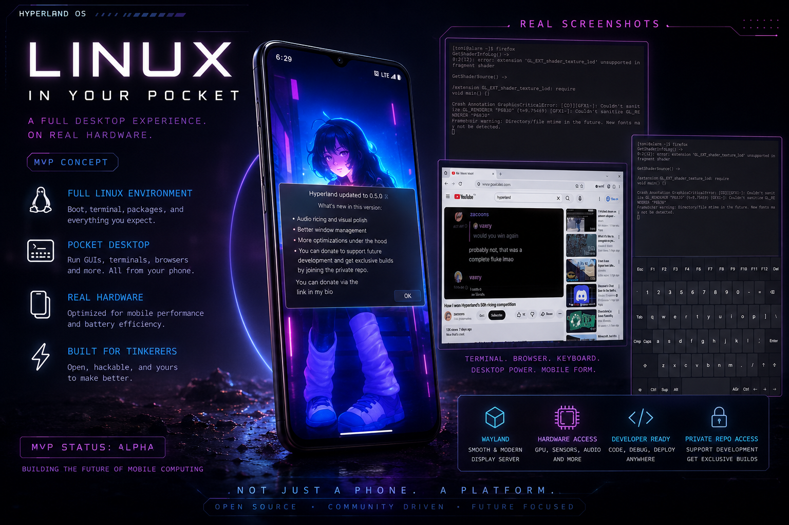
</p>

<p align="center">
  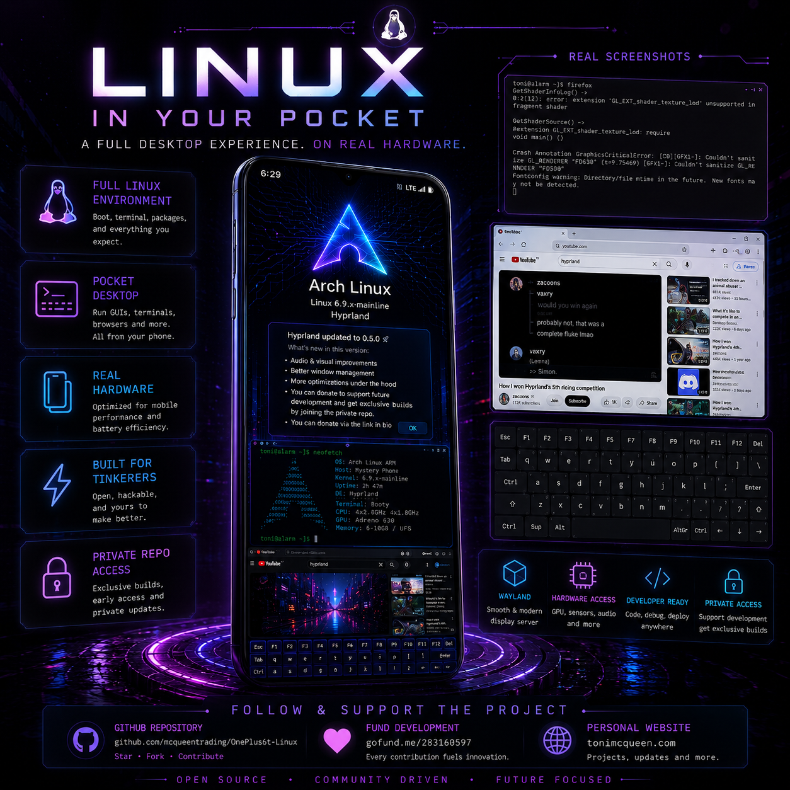
  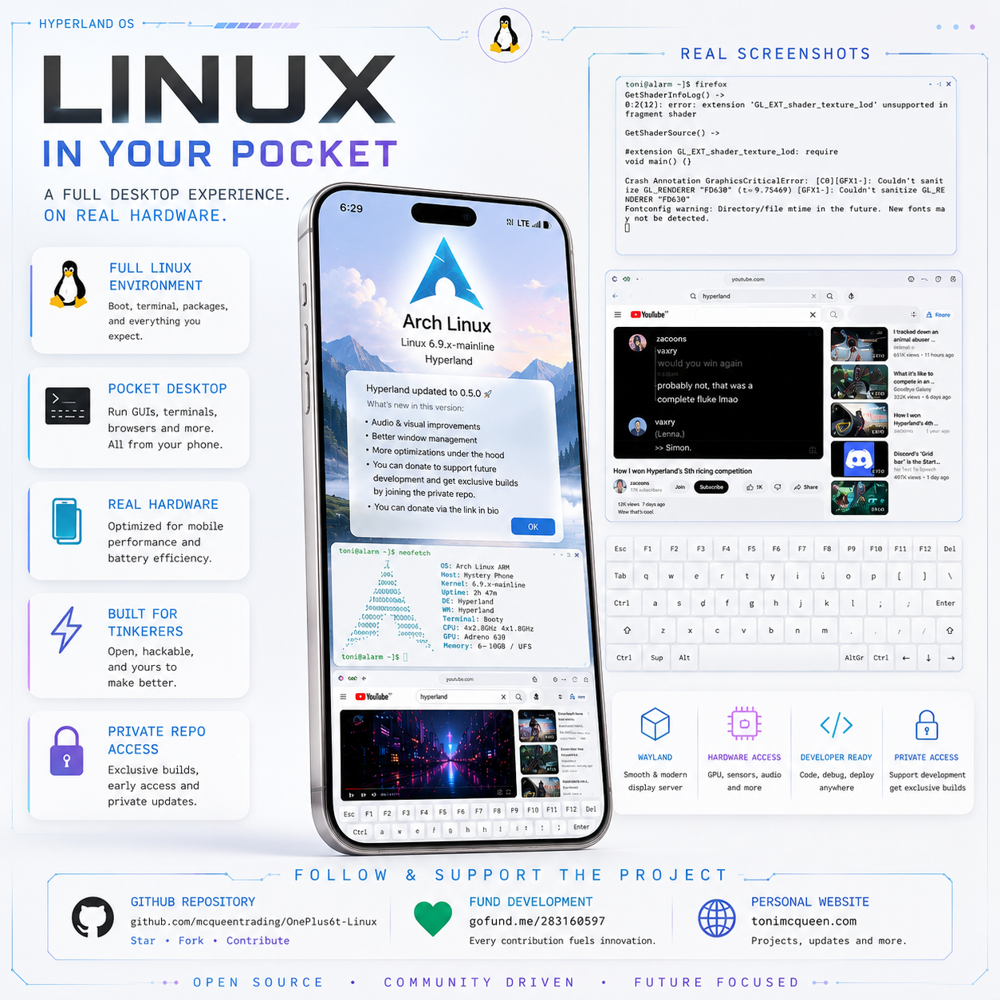
</p>

<p align="center">
  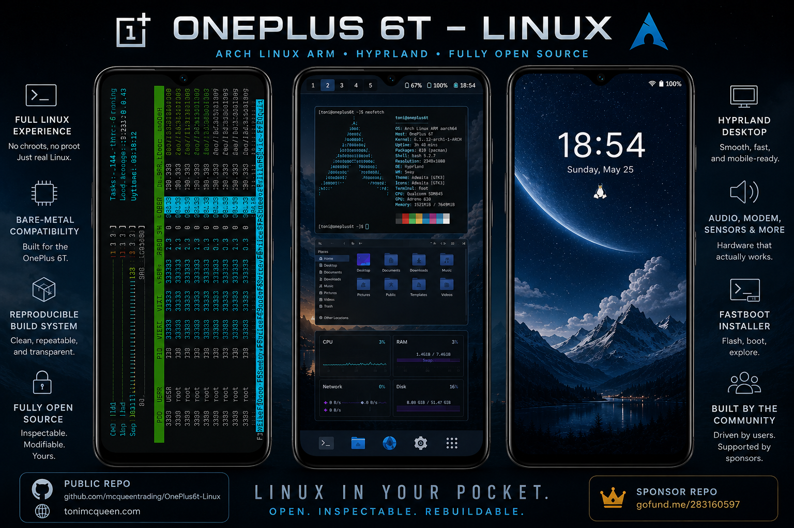
  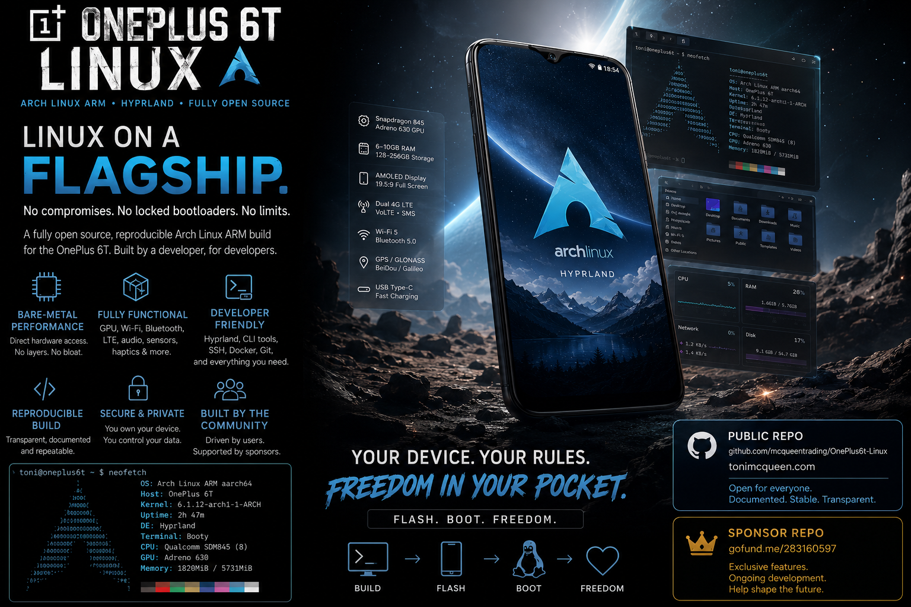
</p>

### Technical Overview

| Stage | What happens |
| --- | --- |
| 1 | Bootloader-unlocked OnePlus 6T is placed in fastboot mode |
| 2 | Sponsored installer checks USB/fastboot visibility |
| 3 | Release inputs are fetched and verified |
| 4 | Matched boot/root images are built for the attached phone |
| 5 | User types `FLASH` at the destructive confirmation gate |
| 6 | Installer flashes disabled vbmeta, boot, and userdata |
| 7 | Phone boots Arch Linux ARM into the Hyprland phone shell |
| 8 | Calls, SMS, data, Wi-Fi, audio, sensors, keyboard, and power helpers start |

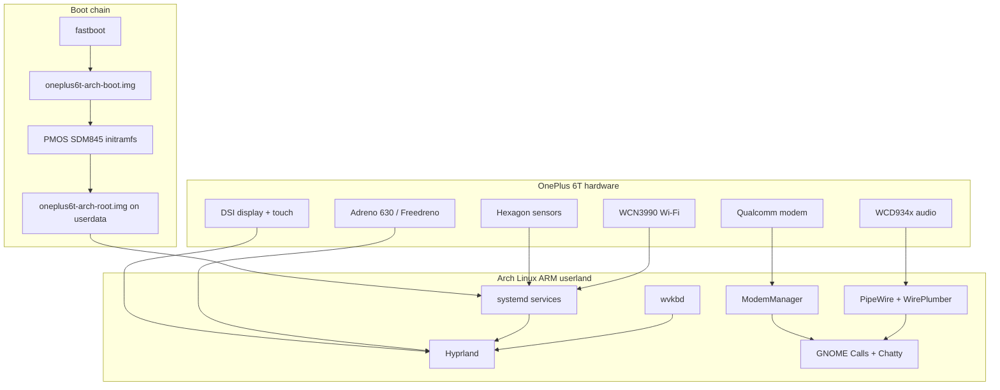

## Bootloader Unlock Quick Guide

You must unlock the OnePlus 6T bootloader before this installer can flash the
phone. This wipes Android user data.

On stock Android/OxygenOS:

1. Open `Settings`.
2. Go to `About phone`.
3. Tap `Build number` seven times until Android says Developer options are
   enabled.
4. Go back to `Settings -> System -> Developer options`.
5. Enable `OEM unlocking`.
6. Optional but convenient: enable `USB debugging`.
7. Reboot the phone into fastboot mode.

From the Linux host:

```text
fastboot devices -l
fastboot getvar product
fastboot oem unlock
```

Read the warning on the phone, use the volume keys to select the unlock option,
and confirm with the power key. Some bootloaders use:

```text
fastboot flashing unlock
```

After the phone wipes itself, return to fastboot mode before running the
installer. Do not relock the bootloader while this image is installed.

## Fast Install Path

If the bootloader is already unlocked and the phone is already in fastboot
mode, the sponsored install flow is intentionally short:

```sh
git clone https://github.com/ToniMcQueen/oneplus6t-install-linux-Arch-on-arm-845.git
cd oneplus6t-install-linux-Arch-on-arm-845
./oneplus6t-install
```

Because this repository is private, clone access requires the GitHub account
that was granted sponsor repository access.

The one-file launcher prints troubleshooting notes and then runs:

```text
./scripts/check-phone.sh
fastboot devices -l
./scripts/run-full-installer-from-start.sh oneplus-fajita
```

`check-phone.sh` and `fastboot devices -l` only check USB/ADB/fastboot
visibility. They do not unlock, wipe, or flash anything.

### Install Tutorial Flow

The install experience is deliberately linear:

1. Unlock the bootloader in OxygenOS.
2. Reboot the phone into fastboot mode.
3. Clone the sponsor repository.
4. Run `./oneplus6t-install`.
5. Confirm USB/fastboot visibility.
6. Review or adjust the package list.
7. Enter optional username, password, Wi-Fi, and APN details.
8. Let the image build and pass the userdata preflight.
9. Type `FLASH` only when you are ready to erase Android userdata.
10. Boot into Arch Linux ARM on the OnePlus 6T.

### Screenshot Walkthrough

The screenshots below are cropped from a real installer run. They keep the
important decision points and long-running stages visible without publishing
machine-specific prompt history. Users should treat them as a guide to the
shape of the install, not as exact paths for their own machine.

#### 1. Package Review

Before building the root image, the installer shows the profile package list.
Press Enter to accept it, or use `add`, `remove`, `list`, `reset`, and `abort`
to adjust the one-run package manifest.

<p align="center">
  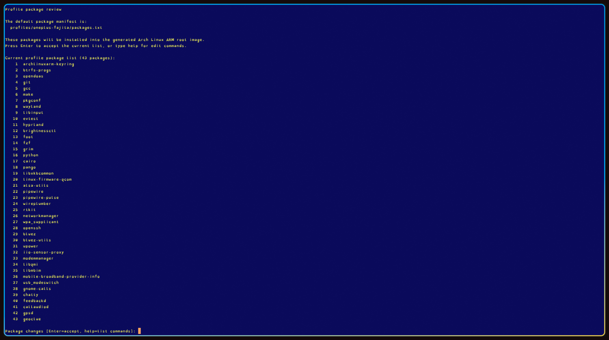
</p>

#### 2. Package Installation Into The Image

The Arch rootfs is populated inside the generated image. Seeing many package
install lines and progress bars is expected; this is the phone filesystem being
assembled, not the phone being flashed yet.

<p align="center">
  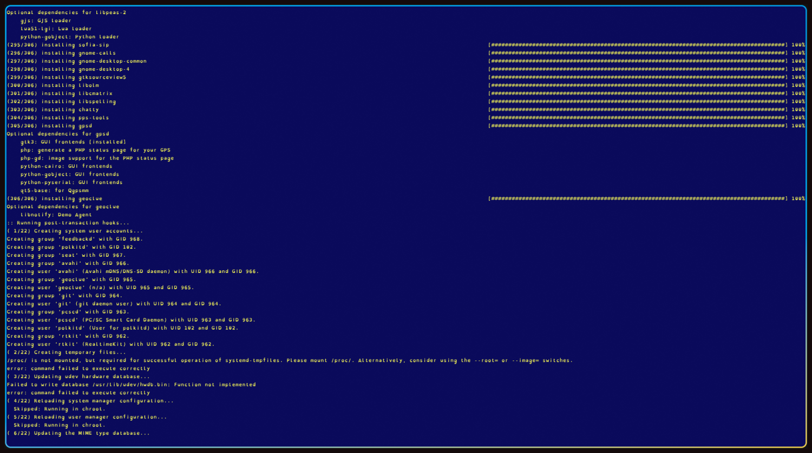
</p>

#### 3. Optional SUPER-Key Launcher Selection

At the image setup stage, the installer can add a launcher package and bind it
to a `SUPER` shortcut. Answer `yes` to the launcher setup prompt, choose the
letter after `SUPER+` that should open it, then type a package name such as
`nwg-menu`, `fuzzel`, `wofi`, or `rofi`. The default launcher key is `S`.
Known menu launchers get their real desktop menu command automatically:
`wofi` becomes `wofi --show drun`, and `rofi` becomes `rofi -show drun`.

The installer refuses phone controls that are already in use: `SUPER+Q`,
`SUPER+H`, `SUPER+C`, `SUPER+K`, and the workspace number keys. Answer `no` or
leave the launcher package prompt blank to keep the image launcher-free.

<p align="center">
  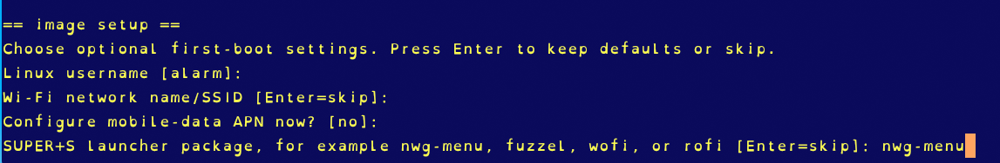
</p>

#### 4. Flash Complete And Reboot Handoff

After the sparse userdata chunks finish writing, the installer sends the
bounded fastboot reboot command. If the bootloader ignores USB reboot at this
stage, start the phone manually from the fastboot menu; the boot and userdata
write may already be complete.

<p align="center">
  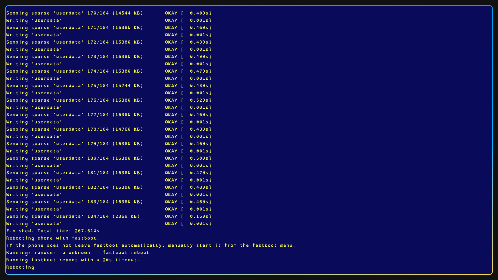
</p>

If you are capturing screenshots for docs, keep them under
`docs/assets/install-tutorial/` and commit them before running the strict
installer. The installer intentionally refuses a dirty tree so the flashed image
can be tied back to a clean commit.

The installer may ask for your laptop/admin password through `doas`, `sudo`, or
`su`; that is the host privilege prompt needed for the Btrfs image build and
fastboot access. The destructive phone flash happens only later, when the
installer asks you to type `FLASH`.

Before the root image build, the installer shows the profile package list and
asks whether you are happy with it. Press Enter to accept the default list.
During review:

```text
+ package-name        add one or more packages
- package-name        remove one or more packages
add package-name      add one or more packages
remove package-name   remove one or more packages
list                  print the current selected list again
reset                 restore profiles/oneplus-fajita/packages.txt
abort                 stop before build/flash
```

The edited list is written under `work/` and is used only for that installer
run. Set `REVIEW_PROFILE_PACKAGES=0` to skip this prompt and use
`profiles/oneplus-fajita/packages.txt` exactly as committed.

## Current Installer Contract

The current installer is designed to be reproducible while still letting the
person flashing the phone make practical choices before the destructive step.

The from-start wrapper:

1. prints the current git commit;
2. initializes missing source submodules;
3. fetches and verifies the release input bundle;
4. refuses to continue from a dirty tree;
5. syntax-checks the build/flash scripts;
6. runs the profile/UI contract check;
7. verifies the expected flash defaults;
8. checks fastboot visibility;
9. warms up `doas`, `sudo`, `su`, or root access;
10. hands off to `scripts/install-release.sh`.

The install script then prompts for optional image setup:

| Prompt | Default if skipped | Where it goes |
| --- | --- | --- |
| kernel track | stable PMOS 6.9 SDM845 snapshot | choose `camera` only to test the experimental IMX519/camera kernel |
| Linux username | `alarm` | account name in the generated rootfs |
| root SSH/su password | `alarm` temporary default | root account in the image |
| desktop/login password | `alarm` temporary default | selected user account |
| Wi-Fi SSID/password | unset | NetworkManager connection file if supplied |
| mobile APN/user/password | unset | `/etc/oneplus6t-mobile-data.conf` if supplied |
| `SUPER` app launcher | unset | opt in, choose a free letter key after `SUPER+`, then type a launcher package name to add it to the one-run manifest and bind that shortcut |
| boot intro video | bundled video | press Enter for the bundled intro, type `none` for verbose boot, or paste a local video path |
| package list | committed profile manifest | generated one-run manifest under `work/` |

At this stage, decide whether to set up an application launcher shortcut. If
enabled, choose the `SUPER+` letter key first, then select your launcher
package. Leaving the package blank skips the launcher binding. The installer
binds `wofi` as `wofi --show drun` and `rofi` as `rofi -show drun`, because
those launchers need a mode argument to show desktop applications.


Blank passwords are allowed for local alpha convenience, but the generated
image prints a clear reminder to change them after first boot. For stricter
builds, use:

```text
ALLOW_INSECURE_DEFAULT_PASSWORD=0
SSH_AUTHORIZED_KEYS_FILE=/path/to/id_ed25519.pub
```

Useful non-interactive overrides:

```text
INSTALLER_SETUP_PROMPT=0
INSTALLER_PASSWORD_PROMPT=0
REVIEW_PROFILE_PACKAGES=0
INSTALL_KERNEL_TRACK=stable
INSTALL_USERNAME=alarm
INSECURE_ROOT_PASSWORD=alarm
INSECURE_ALARM_PASSWORD=alarm
INSTALL_WIFI_SSID=
INSTALL_WIFI_PASSWORD=
INSTALL_MOBILE_APN=
INSTALL_MOBILE_APN_USER=
INSTALL_MOBILE_APN_PASSWORD=
INSTALL_APP_LAUNCHER_PACKAGE=
INSTALL_APP_LAUNCHER_COMMAND=
INSTALL_APP_LAUNCHER_KEY=S
INSTALL_BOOT_VIDEO=
INSTALL_BOOTANIMATION_ENABLE=1
INSTALL_BOOTANIMATION_ZIP=
```

The generated root image is sized from the attached phone:

```text
ROOT_IMAGE_SIZE_FROM_FASTBOOT=1
ALLOW_FASTBOOT_USERDATA_SIZE_FALLBACK=0
```

That means a 128 GB and a 256 GB OnePlus 6T get different sparse root images,
matching the real `userdata` size reported by fastboot. The strict preflight
then checks that the sparse image virtual size matches the phone before the
flash command is allowed to run.

Default flash policy:

```text
DISABLE_ANDROID_VERIFICATION=1
FASTBOOT_SPARSE_SIZE=16M
ROOT_FLASH_PASSES=1
ERASE_USERDATA_BEFORE_FLASH=0
EXT4_CLEANSTAGE_BEFORE_BTRFS=0
USERDATA_PREFLIGHT=strict from install-release.sh
USERDATA_PREFLIGHT=warn from direct flash-release.sh
```

The result is still intentionally conservative: one Btrfs userdata flash pass,
no default fastboot erase, no default ext4 clean-stage, bounded flash timeouts,
and a bounded reboot fallback if the bootloader ignores the first reboot
command.

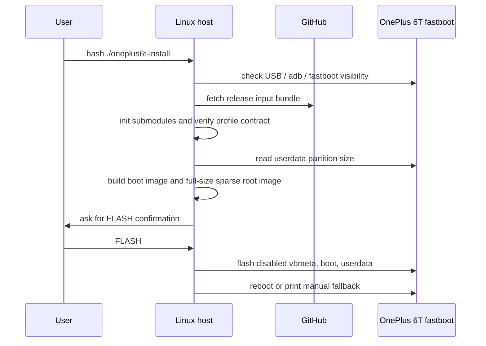

## Use The From-Start Installer

**For normal installs, use the repo's from-start installer. Do not begin with
manual `fastboot flash` commands.**

The from-start installer is the supported entrypoint because it performs
the required checks in the right order:

- initializes source submodules such as `wvkbd`
- fetches and verifies the release input bundle
- checks the profile/UI contract
- lets you review, add, or remove profile packages
- detects the attached phone's real `userdata` partition size
- builds the matched boot/root image pair
- runs the userdata preflight
- flashes only after its normal confirmation prompt

Run it from the repository root:

```text
scripts/run-full-installer-from-start.sh oneplus-fajita
```

## What The Installer Touches

The installer is destructive to Android user data. It is deliberately narrow
about the partitions it writes.

| Target | Written by default | Why |
| --- | --- | --- |
| active-slot `vbmeta` | yes | disables Android verified-boot enforcement for the custom boot image |
| active-slot `boot` | yes | boots the PMOS SDM845 kernel/initramfs handoff |
| `userdata` | yes | stores the Arch Linux ARM Btrfs root image |
| `dtbo` | no | keep device-tree overlays intact |
| `modem` | no | keep radio firmware intact |
| `vendor` | no | keep stock vendor partitions intact |
| `persist` | no | keep calibration/provisioning data intact |
| `modemst1/modemst2/fsg/fsc` | no | keep radio/NV state intact |

Installer write map:

```text
installer
  writes:
    active-slot vbmeta -> allow the custom boot image
    active-slot boot   -> PMOS SDM845 kernel/initramfs handoff
    userdata           -> Arch Linux ARM Btrfs root image

  does not write:
    dtbo
    modem
    vendor
    persist
    modemst1 / modemst2 / fsg / fsc
```

The non-destructive checks happen first. The phone is not flashed until the
installer reaches the final prompt and you type:

```text
FLASH
```

## Before You Flash: Unlock Bootloader And Reach Fastboot

This installer expects a OnePlus 6T with an unlocked bootloader and a working
USB fastboot connection. This is the same prerequisite called out by the
postmarketOS OnePlus 6/6T device pages, and it is destructive: unlocking the
bootloader wipes Android user data.

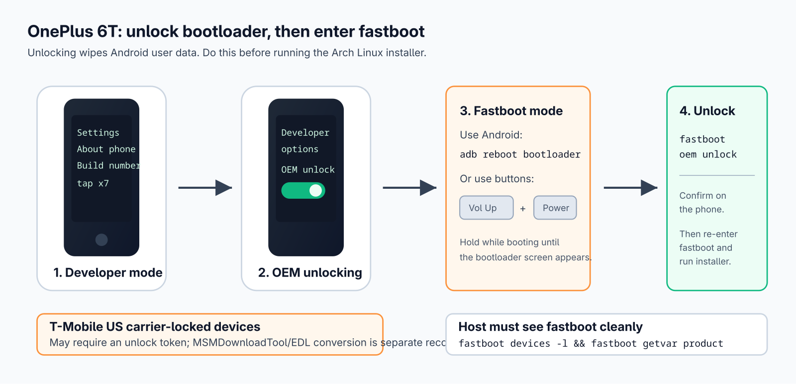

Reference pages:

```text
https://wiki.postmarketos.org/wiki/OnePlus_6_(oneplus-enchilada)
https://wiki.postmarketos.org/wiki/OnePlus_6T_(oneplus-fajita)
https://source.android.com/docs/core/architecture/bootloader/locking_unlocking
```

### Not Carrier Locked

If stock Android/OxygenOS still boots:

1. Back up anything important. Bootloader unlock and this installer both erase
   phone-side user data.
2. Open Android settings, go to `About phone`, and tap `Build number` seven
   times to enable Developer options. Android normally enables it after seven
   taps; some guides say to tap around ten times because the message appears
   only after the required count is reached.
3. Open `System -> Developer options`, then enable `OEM unlocking`.
4. Enable `USB debugging` if you want to use `adb reboot bootloader`; it is not
   required once the phone is already in fastboot mode.
5. Connect the phone to the Linux host and reboot to bootloader:

```text
adb devices
adb reboot bootloader
```

If Android does not boot, power the phone off, then hold `Volume Up + Power`
until the OnePlus fastboot/bootloader screen appears. On the OnePlus 6/6T,
`Volume Down + Power` usually enters recovery instead, not fastboot.

On the host, confirm that fastboot can really talk to the phone before running
any installer:

```text
fastboot devices -l
fastboot getvar product
fastboot getvar partition-size:userdata
```

For a normal global/unlocked OnePlus 6T, unlock from fastboot with:

```text
fastboot oem unlock
```

Read the warning on the phone, select the unlock confirmation with the volume
keys, and accept with the power key. Some bootloaders use the newer generic
Android command instead:

```text
fastboot flashing unlock
```

After unlock, Android normally wipes itself and reboots. Re-enter fastboot before
running this installer. Do not relock the bootloader while this Arch Linux image
is installed.

### Carrier Locked

The US T-Mobile OnePlus 6T can require an unlock token before
`fastboot oem unlock` will work. Search current OnePlus 6T T-Mobile unlock-code
guides first. If that path is blocked, the community fallback is to research the
OnePlus 6T MSMDownloadTool/EDL conversion guides for restoring an international
OxygenOS build first. That is outside this installer, requires Windows plus
Qualcomm USB drivers, and is risky enough that it should be treated as a
separate recovery project rather than a normal install step.

### EDL Mode

Qualcomm Emergency Download mode is a low-level recovery mode used by OEM tools
for firmware service and recovery. It is not normal fastboot mode, and this
installer does not require it. It is still useful to document because it can
help with recovery, offline charging behaviour, and read-only pre-flash backups.

Enter EDL from a powered-off phone:

1. Unplug USB.
2. Hold `Volume Up + Volume Down`.
3. While holding both volume keys, plug the USB cable into the host or charger.
4. The screen normally stays black. Release the buttons after a few seconds.

Exit EDL:

```text
hold Power for 10-15 seconds
```

On a Linux host, an EDL device usually appears as Qualcomm `9008`:

```text
lsusb | grep -i '05c6:9008'
```

### Read-Only EDL Backup Notes

The OnePlus 6T uses UFS storage with multiple logical units. A LUN 0 dump is a
raw 1:1 backup of UFS LUN 0 only; it is not necessarily a complete backup of
every bootloader, modem, boot, vendor, and userdata partition. For example,
boot partitions on many Qualcomm UFS devices live on a different LUN. If you
want a full forensic-style backup, dump all LUNs or dump the GPT/partitions
from every LUN.

The open-source `edl` tool documents read commands for UFS devices:

```text
https://github.com/bkerler/edl
```

Keep EDL work read-only unless you are deliberately doing recovery. Do not run
`edl w`, `edl wl`, `edl wf`, or `edl e` from an install guide.

Example read-only LUN 0 survey and raw dump:

```text
edl printgpt --memory=ufs --lun=0
edl rf oneplus6t-lun0.bin --memory=ufs --lun=0
```

Example read-only all-LUN raw dump:

```text
edl rf oneplus6t-ufs.bin --memory=ufs
```

The all-LUN command writes separate output files for the detected UFS LUNs. It
needs a lot of host disk space. On a 128 GB OnePlus 6T, plan for more than
128 GB free before starting, and keep the generated files off the phone itself.

Example partition-level backup with XML metadata:

```text
edl rl oneplus6t-edl-dumps --memory=ufs --genxml
```

If loader autodetection fails, you may need a compatible OnePlus 6T/SDM845 UFS
Firehose loader and an explicit `--loader /path/to/prog_firehose_ufs.elf`
argument. Keep that loader with the backup notes so the dump can be interpreted
later.

This is not a finished phone distribution yet. It is a reproducible path from
Arch Linux ARM plus the working postmarketOS SDM845 boot stack to a bootable
Linux root filesystem on the OnePlus 6T userdata partition.

## Technical Visual Overview

The current release line stays on the proven PMOS 6.9 SDM845 kernel path and
imports the working PMOS hardware bring-up pattern into Arch Linux ARM.

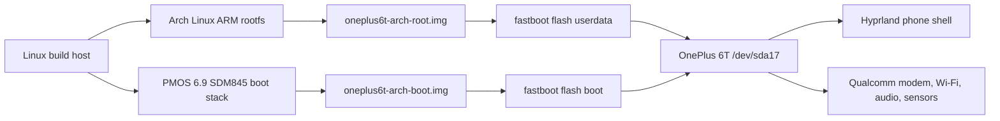

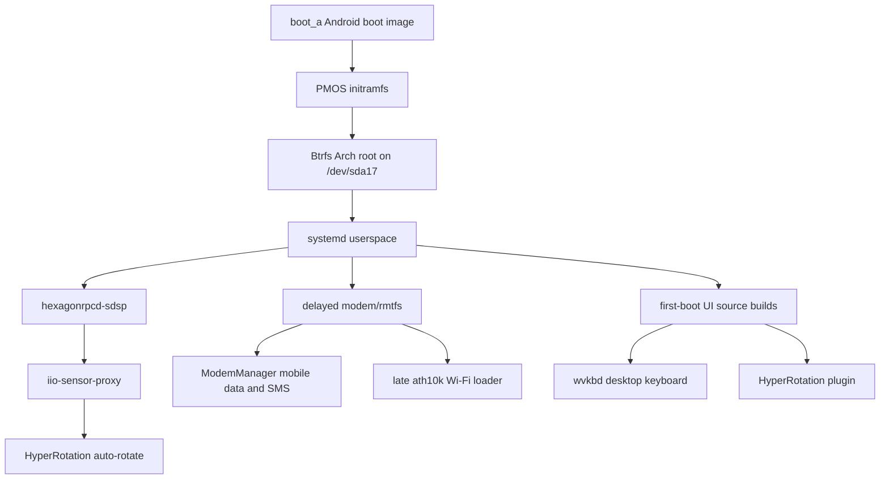

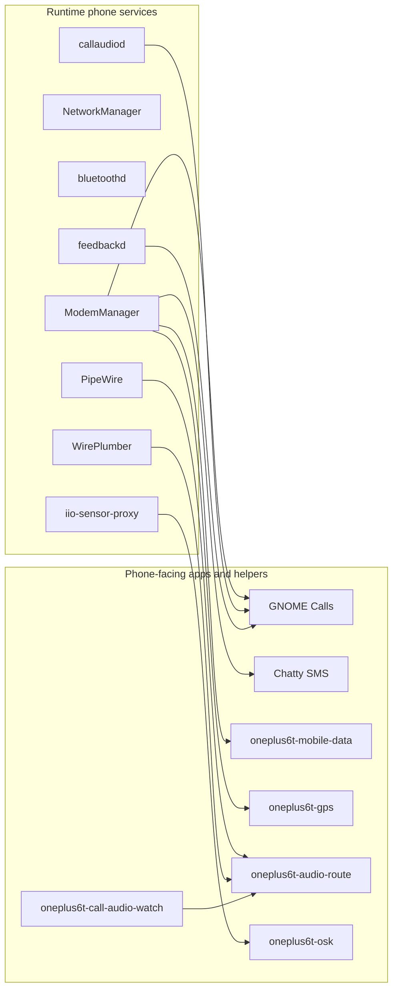

## Status At A Glance

| Area | Current sponsored-image status | Default image policy |
| --- | --- | --- |
| Boot/root | Paired boot + full-userdata sparse root images | Ship matched pairs only |
| Display/touch | DSI-1 1080x2340 Hyprland desktop and touchscreen | Included |
| GPU acceleration | Freedreno FD630 runtime path present; benchmark tools are optional | Runtime included; diagnostics excluded by default |
| Keyboard | `wvkbd-deskintl` with desktop/Linux keys and phone sizing | Included |
| Launcher/terminal | `SUPER+Q` terminal; app launcher intentionally left to user choice | Terminal included; launcher unforced |
| Rotation | PMOS-style Hexagon/SensorProxy path plus HyperRotation | Included; rotation is functional rather than visually polished |
| Wi-Fi | Late `ath10k_snoc` load path after modem/rmtfs timing | Included; no private credentials |
| Mobile data | ModemManager/qmapmux data path with local APN helper | Included; no carrier credentials |
| Calls/SMS | GNOME Calls, Chatty, ModemManager, callaudiod, route watcher | Included; carrier/SIM behavior still needs user validation |
| Audio | Media loudspeaker, call earpiece, speakerphone, and mic route helpers | Included |
| Bluetooth | BlueZ userspace and audio path | Included |
| Haptics | Force-feedback vibration helper | Included |
| GPS | ModemManager/Qualcomm LOC helper | Included; outdoor fix must be validated per device/SIM |
| Lock screen | No lock screen in the default image | Excluded |
| Camera | Camera kernel research exists outside the default image | Excluded |
| Suspend | `s2idle` suspend/resume path exists | Included in smoke gate |

## Current Verified Prototype State

Known default-image shape:

```text
boot slot: a
root: /dev/sda17
filesystem: btrfs
label: archroot
uuid: 8f3b0c30-9845-451d-aed4-7e80541a0d29
kernel: 6.9.0-sdm845
USB network target: 172.16.42.1
```

The current boot path is:

```text
boot_a -> PMOS SDM845 kernel/initramfs -> Arch Linux ARM root on /dev/sda17
```

Current hardware validation highlights:

```text
display: DSI-1 1080x2340@60 through Hyprland
GPU: Freedreno FD630 GL smoke passed during bring-up; diagnostic benchmark tools are not installed by default
Wi-Fi: wlan0 present; NetworkManager path included, no private credentials stored in repo
cellular: SIM/UIM selection and ModemManager PDP/qmapmux helper paths included
mobile APN setup: use oneplus6t-mobile-data configure; images do not embed carrier credentials
Bluetooth: BlueZ path included
audio: PMOS fajita ALSA UCM imported; media, voice-call, speakerphone, and mic route helpers included
sensors: PMOS-style Hexagon/SensorProxy path enabled; Hyprland auto-rotate starts by default
SMS: ModemManager/Chatty path included
calls: GNOME Calls/callaudiod route watcher included; carrier/SIM testing remains environment-specific
camera: reproducible camera-kernel research exists, but default images exclude it
CPU power: bootstrap cpufreq profile applies schedutil/ondemand-style idle scaling through editable /etc/oneplus6t-cpu-power.conf
```

The current working boot image uses:

```text
pmos.stowaway
pmos_root_uuid=8f3b0c30-9845-451d-aed4-7e80541a0d29
pmos_root=/dev/sda17
rootfstype=btrfs
```

The old PMOS `pmos_boot_uuid=` must not be used with this layout. It pointed at
the old PMOS userdata boot subpartition, which no longer exists after converting
userdata to plain Btrfs.

## What This Repo Builds

This repo builds:

```text
out/oneplus-fajita/oneplus6t-arch-boot.img
out/oneplus-fajita/oneplus6t-arch-root.img
```

The default boot image is an Android boot image made from:

```text
PMOS vmlinuz
PMOS sdm845-oneplus-fajita.dtb
PMOS initramfs
known-good OnePlus 6T mkbootimg offsets
known-good /dev/sda17 stowaway cmdline
```

An opt-in camera candidate replaces only the kernel, matching modules, and DTB
with the source-pinned `linux-oneplus6t-camera` package. It keeps the proven
PMOS initramfs and boot parameters so rollback remains straightforward.
The stable golden image does not install `linux-oneplus6t-camera`, even if the
package is staged locally; camera packages are accepted only when
`BOOT_KERNEL_SOURCE=camera-package` is selected.

The root image is a Btrfs image made from:

```text
Arch Linux ARM aarch64 rootfs
OnePlus 6T profile config
native packages from profiles/oneplus-fajita/packages.txt
PMOS initramfs-extra and boot artifacts copied into /boot
profile overlay files
```

On first boot, `oneplus6t-pacman-keyring.service` creates the root-owned pacman
GnuPG database and populates it from the packaged Arch Linux ARM trust files.
This leaves normal signature verification enabled for package installation;
images do not rely on `SigLevel=Never` at runtime. If the phone boots
with a 1970 clock, the helper seeds time from the image timestamp before
touching `pacman-key`. After recording the completion marker, the target-side
bootstrap script removes its installed copy.

When `img2simg` is available, the raw root image is converted to Android sparse
image format so `fastboot flash userdata` is practical.

## Swapping The Root Distro

The supported installer builds Arch Linux ARM. Swapping in Debian, Alpine,
postmarketOS, Ubuntu, Mobian, or another rootfs is possible, but it is a port,
not a package-list change.

The clean boundary is:

```text
keep:
  OnePlus 6T fastboot checks
  PMOS SDM845 boot kernel / DTB / initramfs handoff
  vbmeta disable step
  userdata sparse-image flash path
  strict userdata-size preflight

replace:
  scripts/build-rootfs-image.sh
  profiles/oneplus-fajita/packages.txt
  distro package installation
  distro service enablement
  distro-specific desktop / phone / audio / modem glue
```

Any replacement root image must satisfy the same boot contract unless the boot
profile is changed at the same time:

```text
userdata contains the root filesystem
root filesystem is mounted by the PMOS initramfs
ROOT_UUID matches profiles/oneplus-fajita/config.env
/etc/fstab matches that UUID and filesystem type
root filesystem includes matching /usr/lib/modules and /usr/lib/firmware
root filesystem includes the init system, login path, networking, SSH, udev,
D-Bus, graphics, audio, modem, sensor, and phone UI services needed by that distro
```

For example, a Debian-style port would replace the Arch Linux ARM tarball and
`pacman` package stage with `debootstrap`/`mmdebstrap`, then recreate the
OnePlus 6T overlay equivalents as Debian packages, files, or systemd units. An
Alpine-style port would do the same with `apk`, OpenRC or systemd decisions,
and Alpine package names.

Do not flash a different distro root image by itself if the UUID, filesystem,
root device, kernel modules, or initramfs expectations changed. The boot image
and root image must still be treated as a matched pair.

## Repository Layout

```text
oneplus6t-install                       one-file sponsored install launcher
profiles/oneplus-fajita/config.env       device profile and boot parameters
profiles/oneplus-fajita/overlay/         files copied into the rootfs image
scripts/build-bootimg.sh                 builds oneplus6t-arch-boot.img
scripts/build-rootfs-image.sh            builds oneplus6t-arch-root.img
scripts/build-release.sh                 runs both builders
scripts/fetch-release-inputs.sh          downloads/imports non-git release inputs
scripts/make-release-inputs-bundle.sh    maintainer helper for GitHub Release input bundle
scripts/package-prebuilt-flash-bundle.sh packages built boot/root images for web hosting
scripts/install-release.sh               builds full-userdata root image and flashes
scripts/run-full-installer-from-start.sh strict checked build + flash wrapper
scripts/flash-release.sh                 flashes boot and userdata as a pair
scripts/check-phone.sh                   non-destructive USB/fastboot check
scripts/resolve-profile-packages.sh      resolves/downloads the aarch64 package layer
scripts/build-hexagonrpcd-package.sh     builds the local sensor daemon package on aarch64
scripts/build-oneplus-firmware-package.sh builds/stages the OnePlus SDM845 base firmware package
scripts/build-oneplus-sensors-package.sh builds/stages the OnePlus SDM845 sensor payload package
scripts/build-camera-kernel-package.sh  builds/stages the pinned SDM845 camera kernel on aarch64
scripts/camera-kernel-contract-check.sh validates camera source/package/build wiring
scripts/stage-local-package.sh           symlinks local package artifacts into image injection dir
scripts/snapshot-images.sh               saves labelled boot/root image checkpoints
scripts/replace-boot-video.sh            converts a local video into bootanimation.zip
oneplus6t-sensor-lab                     target-side bounded Hexagon sensor debug helper
oneplus6t-cpu-power                      target-side cpufreq policy/status helper
vendor/pmos-oneplus-fajita/              local PMOS boot artifact staging area
vendor/wvkbd/                            pinned wvkbd OSK source cache
image-snapshots/                         local ignored image checkpoints and manifests
docs/assets/                            README visual assets
docs/THIRD-PARTY-NOTICES.md            upstream credits and license notes
```

Generated images, caches, and vendor boot artifacts are ignored by git.

## Host Requirements

Build host:

```text
Linux
bash
aarch64 Arch Linux ARM environment for default sensor-enabled builds
curl
tar
rsync
mkfs.btrfs
mount/umount
mkbootimg
img2simg
fastboot
avbtool
sha256sum
pacman
doas or sudo
```

The top-level release builder uses `doas` when available and falls back to
`sudo` for the root image step. The root image builder itself must run as root
because it creates and mounts a Btrfs filesystem image.

If neither `doas`, `sudo`, nor `su` is usable on the host, the installer cannot
build the root image. Install and configure one privilege tool first, or run the
installer from a root shell. On Arch-family hosts, a minimal `doas` setup is:

```text
pacman -S opendoas
echo 'permit persist :wheel' > /etc/doas.conf
usermod -aG wheel "$USER"
```

Log out and back in after changing group membership.

On Arch Linux, the likely packages are:

```text
android-tools
btrfs-progs
curl
rsync
zstd
```

On Arch-family hosts, `android-tools` normally provides `adb`, `fastboot`, and
`avbtool`. Package names differ on other distributions.

Default OnePlus 6T builds enable the sensor/auto-rotate path. That path
requires a native aarch64 `hexagonrpcd` package. On aarch64, the release builder
builds and stages it automatically. On other host architectures, stage an
existing `hexagonrpcd-*-aarch64.pkg.tar.*` first or build a recovery image with
`ENABLE_HEXAGON_SENSORS=0`.

## PMOS Boot Artifacts

This project currently depends on the postmarketOS SDM845 OnePlus 6T boot stack.

For normal installs, the strict from-start installer fetches this bundle
automatically before it validates or builds the image:

```text
scripts/run-full-installer-from-start.sh oneplus-fajita
```

To fetch the bundle manually:

```text
scripts/fetch-release-inputs.sh
```

That places the PMOS boot files, local aarch64 package artifacts, and optional
PMOS compatibility/reference payloads into the paths expected by the builders.
The repo stays source-clean while the GitHub Release carries the large/generated
inputs.

If you are testing from a private fork, GitHub's unauthenticated release
download URL may return `404`. In that case, authenticate the GitHub CLI first
and the fetch script will fall back to `gh release download`:

```text
gh auth login
```

The strict from-start installer initializes source submodules automatically, but
manual builders can do it explicitly:

```text
git submodule update --init --recursive
```

If host tools such as `curl`, `tar`, `zstd`, or `sha256sum` are missing on an
Arch-family host, the script detects `pacman`, `paru`, or `yay` and prints the
right install command. To let it install the missing host tools automatically:

```text
scripts/fetch-release-inputs.sh --install-deps
```

Before building, place the working PMOS boot artifacts here:

```text
vendor/pmos-oneplus-fajita/boot/
```

Expected files:

```text
vmlinuz
initramfs
initramfs-extra
sdm845-oneplus-fajita.dtb
linux.efi
boot.img
```

These files are intentionally not stored in git.

## Build Configuration

Main profile:

```text
profiles/oneplus-fajita/config.env
```

Important defaults:

```text
ROOT_DEVICE=/dev/sda17
ROOT_LABEL=archroot
ROOT_UUID=8f3b0c30-9845-451d-aed4-7e80541a0d29
ROOT_IMAGE_SIZE=8G
BTRFS_MKFS_FEATURES=^block-group-tree
ARCHLINUXARM_ROOTFS_URL=http://os.archlinuxarm.org/os/ArchLinuxARM-aarch64-latest.tar.gz
INSTALL_PROFILE_PACKAGES=1
SSH_AUTHORIZED_KEYS_FILE=
SSH_AUTHORIZED_KEYS_GLOB=
DISABLE_SSH_PASSWORD_AUTH=1
HYPERROTATION_REF=38606861f25a2aec1eaefae38f3bcb8d0c332972
BOOT_KERNEL_SOURCE=pmos-snapshot
```

The URL points at the Arch Linux ARM aarch64 latest rootfs. For reproducible
releases, pin and checksum a specific downloaded tarball instead of relying only
on the moving latest URL.

## Build Boot Image

Builds:

```text
out/oneplus-fajita/oneplus6t-arch-boot.img
out/oneplus-fajita/oneplus6t-arch-boot.img.sha256
```

Script:

```text
scripts/build-bootimg.sh
```

The boot image uses the known-good OnePlus 6T Android boot header values:

```text
--base 0x00000000
--kernel_offset 0x00008000
--ramdisk_offset 0x01000000
--second_offset 0x00f00000
--tags_offset 0x00000100
--pagesize 4096
--header_version 0
```

## Build Root Image

Builds:

```text
out/oneplus-fajita/oneplus6t-arch-root.raw.img
out/oneplus-fajita/oneplus6t-arch-root.img
out/oneplus-fajita/oneplus6t-arch-root.img.sha256
```

Script:

```text
scripts/build-rootfs-image.sh
```

The sparse `.img` is the intended fastboot artifact. The raw image is kept as a
debug/build intermediate.

The builder writes this `/etc/fstab` into the image:

```text
UUID=8f3b0c30-9845-451d-aed4-7e80541a0d29 / btrfs rw,noatime,compress=zstd:3 0 1
```

The root image builder disables Btrfs `block-group-tree` by default for now.
That keeps the userdata filesystem conservative for the PMOS SDM845
kernel/initramfs handoff.

The profile explicitly installs `archlinuxarm-keyring`. Its first-boot service
initializes `/etc/pacman.d/gnupg`, populates the Arch Linux ARM keys, and records
completion in `/var/lib/oneplus6t/pacman-keyring-ready`. The helper handles the
phone's missing RTC by seeding a sane clock from the image timestamp before
running `pacman-key`.

It also copies PMOS files to top-level `/boot` because PMOS initramfs expects:

```text
/boot/initramfs
/boot/initramfs-extra
/boot/vmlinuz
/boot/sdm845-oneplus-fajita.dtb
```

By default it also installs the package manifest into the mounted image:

```text
profiles/oneplus-fajita/packages.txt
```

This is how the generated root image gets Hyprland UI pieces, terminal/OSK,
Qualcomm firmware packages, audio services, Bluetooth userspace, sensor
services, and modem userspace. Set `INSTALL_PROFILE_PACKAGES=0` only for
low-level boot debugging.

The rootfs builder also injects local aarch64 package artifacts from:

```text
out/oneplus-fajita/packages/
```

Use symlinks instead of copies when space is tight:

```text
scripts/stage-local-package.sh oneplus-fajita /path/to/package.pkg.tar.xz
```

The first local package is `hexagonrpcd`, needed by the Qualcomm sensor stack.
It must be built on aarch64 or in an aarch64 build environment:

```text
scripts/build-hexagonrpcd-package.sh oneplus-fajita
```

Release users should not need to build `hexagonrpcd` themselves if they
have already run:

```text
scripts/fetch-release-inputs.sh
```

Maintainers create that release input bundle with:

```text
scripts/make-release-inputs-bundle.sh
```

The maintainer bundle includes staged `linux-oneplus6t-camera` research
packages when they are available, but the installer still keeps the stable PMOS
6.9 kernel unless the user explicitly selects the `camera` kernel track. Use
`--exclude-camera` only for a stable-only release asset.

Upload both generated files from `out/oneplus-fajita/release-inputs/` to the
GitHub Release:

```text
oneplus6t-release-inputs.tar.zst
oneplus6t-release-inputs.tar.zst.sha256
```

The OnePlus SDM845 base firmware and sensor payload are packaged separately
from the PMOS `firmware.files` and `sensor.files` manifests:

```text
scripts/build-oneplus-firmware-package.sh oneplus-fajita
scripts/build-oneplus-sensors-package.sh oneplus-fajita
```

That package installs proprietary firmware/registry data from the upstream
OnePlus SDM845 firmware archive, so generated packages and downloaded archives
stay out of git. OnePlus 6T images enable the PMOS-style Hexagon/IIO
sensor path by default:

```text
hexagonrpcd-sdsp.service
iio-sensor-proxy.service
```

The builder still keeps the ADSP fallback services masked because they are not
part of the working PMOS-style path:

```text
hexagonrpcd-adsp-rootpd.service
hexagonrpcd-adsp-sensorspd.service
```

For crashdump recovery images, opt out explicitly:

```text
ENABLE_HEXAGON_SENSORS=0 scripts/build-rootfs-image.sh oneplus-fajita
```

The enabled path mirrors the working PMOS timing by enabling
`hexagonrpcd-sdsp.service` in `sysinit.target`, delaying
`iio-sensor-proxy.service`, keeping the ADSP fallback services masked, and
starting `/usr/local/bin/oneplus6t-auto-rotate` from Hyprland.

The profile ships pinned source caches for the default phone UI pieces:

```text
vendor/wvkbd          -> /var/cache/oneplus6t/wvkbd
vendor/hyperrotation  -> /var/cache/oneplus6t/hyperrotation
```

These are pinned public forks with OnePlus 6T phone defaults:

```text
https://github.com/jjsullivan5196/wvkbd
  deskintl: 4fd182a58385b4754756e6dc66860e9ff601b3a1
  OnePlus 6T wrapper sizing: full width, 864 px portrait height, 520 px landscape height

https://github.com/mcqueentrading/oneplus6t-hyper-rotation
  main: 38606861f25a2aec1eaefae38f3bcb8d0c332972
```

First-boot services build those components natively on the phone. The default
keyboard is `wvkbd-deskintl`, launched by `/usr/local/bin/oneplus6t-osk` and
shown by the touch gesture daemon through the same wrapper. Builders can replace
those submodules, pin different commits, or remove the services/package entries
if they want a different keyboard or rotation plugin.

tty1 autologin waits for the first-boot UI build services before starting
Hyprland:

```text
oneplus6t-hyperrotation-build.service
oneplus6t-wvkbd-build.service
```

This prevents the first visible Hyprland session from trying to load a missing
`hyperrotation.so`.

For future device ports, keep device-specific boot parameters, firmware,
services, desktop controls, and validation evidence inside the device profile.

## Build Full Release

Script:

```text
scripts/build-release.sh
```

This runs both builders and leaves release artifacts under:

```text
out/oneplus-fajita/
```

The installer exposes this as `INSTALL_KERNEL_TRACK=stable` or
`INSTALL_KERNEL_TRACK=camera`. The known-good build uses
`BOOT_KERNEL_SOURCE=pmos-snapshot`. The camera candidate uses
`BOOT_KERNEL_SOURCE=camera-package`; on aarch64 the release builder builds and
stages the pinned kernel package automatically. Camera userspace remains
separately declared in `profiles/oneplus-fajita/camera-packages.txt`.

## Replace The Boot Intro Video

The image includes a no-audio Android-style `bootanimation.zip` that is played
from Arch userspace during early boot. The installer can keep the bundled intro,
disable it so verbose boot remains visible, or convert a custom local video for
that one build.

At the installer prompt:

```text
Boot intro video [Enter=bundled, none=verbose, or paste video path]:
```

Use:

```text
Enter                 keep the bundled intro video
none                  remove the intro video and show verbose boot
/path/to/video.mov    convert that video into the generated image
```

Videos are converted to `360x780` at `8fps`; audio is ignored. The default
supported video length is `2s` to `45s` because the bootanimation service holds
the framebuffer for up to 45 seconds before the normal login shell continues.

Maintainers can replace the repository default before building:

```sh
scripts/replace-boot-video.sh /path/to/video.mov
```

The helper backs up the previous zip, validates the video duration, strips
audio, writes the Android-style `desc.txt + part0/` archive, and replaces:

```text
profiles/oneplus-fajita/overlay/usr/share/oneplus6t/bootanimation.zip
```

## Save A Hostable Prebuilt Build

After the installer has built a clean boot/root pair, you can package that
exact output for hosting on a website or sharing with another machine. This is
for prebuilt distribution: it does not rebuild the image and it does not flash
the phone.

```sh
TAG=first-hosted-sponsored scripts/package-prebuilt-flash-bundle.sh oneplus-fajita
```

The script verifies the generated boot/root checksums, creates a self-contained
flash bundle, and writes:

```text
out/prebuilt/oneplus6t-archlinux-prebuilt-oneplus-fajita-first-hosted-sponsored.tar.zst
out/prebuilt/oneplus6t-archlinux-prebuilt-oneplus-fajita-first-hosted-sponsored.tar.zst.sha256
```

Upload both files to the website. A user who downloads and extracts the bundle
can flash it with:

```sh
./flash-prebuilt-oneplus6t.sh
```

The extracted bundle includes only the already-built boot/root images, the
minimal flash scripts, checksums, and a manifest. It does not include the build
cache, `work/`, local screenshots, or private setup files.

## Flashing

Warning: flashing userdata erases the phone's userdata partition.

The supported install path is the strict from-start wrapper:

```text
scripts/run-full-installer-from-start.sh oneplus-fajita
```

Manual advanced release flash shape:

```text
fastboot getvar partition-size:userdata
ROOT_IMAGE_SIZE_FROM_FASTBOOT=1 scripts/build-release.sh oneplus-fajita
fastboot flash boot oneplus6t-arch-boot.img
fastboot flash userdata oneplus6t-arch-root.img
fastboot reboot
```

The from-start path builds the root image with the live fastboot
`userdata` partition size. That avoids the repeated-flash failure mode where an
8G Btrfs image leaves an unwritten tail on a much larger userdata partition and
the first boot later grows into old filesystem state.

If a host fastboot build cannot capture `getvar` output, the `oneplus-fajita`
profile falls back to the observed 128GB test-device userdata size
`0x1B800BB000`. Override `FASTBOOT_USERDATA_SIZE_FALLBACK_HEX` for a different
storage variant.

`scripts/flash-release.sh` still uses the direct Btrfs userdata flash as the
normal write path. It runs a userdata preflight before flashing:

```text
USERDATA_PREFLIGHT=warn    warn if root image is smaller than userdata
USERDATA_PREFLIGHT=strict  refuse undersized root images
USERDATA_PREFLIGHT=off     skip the size check
```

Do not erase `dtbo` to fix userdata or Btrfs problems. `dtbo` carries device
tree overlays for hardware bring-up; it is not part of the userdata filesystem
and wiping it can break boot/display behavior.

Do not flash only `userdata` when the root partition, UUID, or PMOS cmdline has
changed. The boot image and root image are a matched pair: the boot image tells
the PMOS initramfs to mount `/dev/sda17` with UUID
`8f3b0c30-9845-451d-aed4-7e80541a0d29`.

The lower-level scripted local path is:

```text
scripts/install-release.sh oneplus-fajita
```

Use the lower-level path only when debugging the installer itself. Clean
checkout tests should use `scripts/run-full-installer-from-start.sh` so missing
submodules, release inputs, privilege setup, and fastboot preflight are handled
consistently.

If the build completed but flashing failed because fastboot, USB, or the phone
state glitched, put the phone back into fastboot mode and resume from the
already-built images:

```sh
CONFIRM_FLASH=1 USERDATA_PREFLIGHT=strict FASTBOOT_SPARSE_SIZE=16M DISABLE_ANDROID_VERIFICATION=1 scripts/flash-release.sh oneplus-fajita
```

That command reuses:

```text
out/oneplus-fajita/oneplus6t-arch-boot.img
out/oneplus-fajita/oneplus6t-arch-root.img
```

It does not rebuild the root filesystem or ask the package/setup prompts again.
`scripts/flash-release.sh` also prints this resume command automatically if a
bounded fastboot command fails.

Default flash behavior:

```text
ERASE_USERDATA_BEFORE_FLASH=0
EXT4_CLEANSTAGE_BEFORE_BTRFS=0
ROOT_FLASH_PASSES=1
FASTBOOT_SPARSE_SIZE=16M
USERDATA_PREFLIGHT=warn
DISABLE_ANDROID_VERIFICATION=1
FASTBOOT_REBOOT_MODE=timeout
FASTBOOT_REBOOT_FALLBACK=reboot
FASTBOOT_REBOOT_AS_CALLER=1
```

Set `ERASE_USERDATA_BEFORE_FLASH=1`, `EXT4_CLEANSTAGE_BEFORE_BTRFS=1`, or
`FASTBOOT_SPARSE_SIZE=0` only for low-level debugging. The default flash path
also writes a disabled `vbmeta` image for the active slot before flashing the
custom boot image; set `DISABLE_ANDROID_VERIFICATION=0` only if you are
intentionally keeping stock Android verification behavior.

The default reboot path wraps `fastboot reboot` in a timeout so the installer
can print the manual fastboot-menu fallback instead of hanging forever. If the
phone still appears in fastboot after `fastboot reboot`, the script tries one
more bounded `fastboot reboot` before asking the user to start it manually from
the fastboot menu. When run through `sudo`/`doas`, reboot commands are run as
the original caller when possible; this matches the manual host-side reboot
path better than holding the final reboot inside the privileged flashing
process.

Use `scripts/check-phone.sh` first to confirm the host can see the phone in the
expected mode.

## First Boot And Access

The local prototype used root SSH over USB networking:

```text
phone: 172.16.42.1
host: 172.16.42.2
```

Published releases should not ship a permanent default password. The low-level
rootfs builder keeps password login disabled unless explicitly told to create a
throwaway local test image with:

```text
ALLOW_INSECURE_DEFAULT_PASSWORD=1
```

For OnePlus 6T local test images this sets root SSH/su and the desktop user
login password to `alarm` when the installer prompts are skipped or left blank.

No lock screen is shipped in the current image. The power key is caught
and logged without turning the panel off, which keeps the current rotation and
wake path conservative.

The end-to-end preview installer path, `scripts/install-release.sh`, asks for
optional first-boot settings before the image is built:

- Linux username, default `alarm`
- root SSH/su password, default `alarm` if left blank
- desktop/login password, default `alarm` if left blank
- Wi-Fi SSID and password, skipped if left blank
- mobile-data APN, skipped unless you choose to configure it

If either password is left blank, the installer prints a softer warning and a
strong reminder to change both passwords soon after first boot:

```text
Security notice: temporary default passwords are enabled because no custom password was entered.
  root SSH/su password: alarm
  alarm desktop/login password: alarm
Please change both passwords to secure ones soon after the first boot.
```

For unattended local lab builds, set `INSTALLER_SETUP_PROMPT=0` and
`INSTALLER_PASSWORD_PROMPT=0`. Optional environment overrides are:

```text
INSTALL_USERNAME=alarm
INSECURE_ROOT_PASSWORD=alarm
INSECURE_ALARM_PASSWORD=alarm
INSTALL_WIFI_SSID=
INSTALL_WIFI_PASSWORD=
INSTALL_MOBILE_APN=
INSTALL_MOBILE_APN_USER=
INSTALL_MOBILE_APN_PASSWORD=
```

Set `ALLOW_INSECURE_DEFAULT_PASSWORD=0` when building an SSH-key-only release
candidate.

For stricter local test images, inject your SSH public key instead:

```text
SSH_AUTHORIZED_KEYS_FILE=/home/you/.ssh/id_ed25519.pub
```

When at least one SSH key is installed, the builder writes:

```text
/home/<installer-username>/.ssh/authorized_keys
/etc/ssh/sshd_config.d/80-oneplus6t-ssh-keys.conf
```

and disables SSH password authentication by default. Prebuilt images
should be published without embedded personal keys and should use a first-boot
setup flow before being promoted as end-user releases.

## Live Smoke Validation

When the phone is booted into Arch and USB networking is reachable, run:

```text
scripts/phone-smoke-report.sh oneplus-fajita
```

The report is written under:

```text
out/oneplus-fajita/
```

The report checks identity, boot files, enabled services, package trust,
Hyprland UI, display/GPU/input, audio/haptics/flash nodes, camera nodes, sensor
services, Wi-Fi/Bluetooth state, mobile data, GPS/GNSS state, CPU/thermal
policy, USB-C classes, and crash evidence.

## Phone And Messaging

The image includes the same practical app direction used by many postmarketOS
phone images, packaged natively for Arch:

```text
gnome-calls    phone dialer and call handler over ModemManager
chatty         SMS messaging over ModemManager
feedbackd      event feedback service used by the mobile app stack
```

These are not copied Alpine/postmarketOS binaries. They are Arch packages, so
they match this image's glibc userspace and pacman package database.

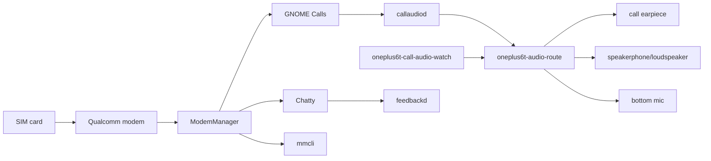

The included phone apps are deliberately ordinary Linux userspace. If you want
to build a different dialer, SMS app, lock screen, panel, or mobile shell, use
the CLI primitives below rather than depending on Hyprland internals.

## Phone And Messaging CLI Primitives

The image also keeps the raw phone/SMS control path documented. Builders can use
these commands directly or wrap them in their own apps, tray tools, scripts,
daemons, or compositor-specific panels.

The examples below assume ModemManager exposes the phone modem as modem `0`.
Check first:

```text
mmcli -L
mmcli -m 0
```

### SMS

Send an SMS:

```text
NUMBER="+441234567890"
TEXT="test from oneplus6t arch"
SMS_PATH="$(mmcli -m 0 --messaging-create-sms="number='${NUMBER}',text='${TEXT}'" | awk -F"'" '/SMS/ { if (NF > 1) print $2; else print $NF; exit }')"
mmcli -s "$SMS_PATH" --send
```

List received/stored SMS messages:

```text
mmcli -m 0 --messaging-list-sms
```

Read one SMS from the path printed by the list command:

```text
mmcli -s /org/freedesktop/ModemManager1/SMS/0
```

Watch for incoming SMS while developing a wrapper:

```text
watch -n 3 'mmcli -m 0 --messaging-list-sms'
journalctl -u ModemManager -f
```

Delete an SMS after processing it:

```text
mmcli -m 0 --messaging-delete-sms=/org/freedesktop/ModemManager1/SMS/0
```

### Calls

Create and start an outgoing call:

```text
NUMBER="+441234567890"
CALL_PATH="$(mmcli -m 0 --voice-create-call="number='${NUMBER}'" | awk -F"'" '/Call/ { if (NF > 1) print $2; else print $NF; exit }')"
mmcli -o "$CALL_PATH" --start
```

List active or recent ModemManager call objects:

```text
mmcli -m 0 --voice-list-calls
```

Hang up a call:

```text
mmcli -o "$CALL_PATH" --hangup
```

Delete an old ModemManager call object after cleanup:

```text
mmcli -m 0 --voice-delete-call="$CALL_PATH"
```

Answer or reject an incoming call object from `--voice-list-calls`:

```text
mmcli -o /org/freedesktop/ModemManager1/Call/0 --accept
mmcli -o /org/freedesktop/ModemManager1/Call/0 --hangup
```

Route audio to the normal loudspeaker or the phone-call earpiece:

```text
oneplus6t-audio-route loudspeaker
oneplus6t-audio-route earpiece
oneplus6t-audio-route speakerphone
oneplus6t-audio-route status
```

### Mobile Data

Images do not ship private carrier APNs. Configure your carrier APN
locally on the phone. When logged in as root, omit `doas`.

Configure the saved APN:

```text
doas oneplus6t-mobile-data configure --apn your.carrier.apn --auto-connect no
oneplus6t-mobile-data config
```

Turn mobile data on for the current boot:

```text
doas oneplus6t-mobile-data connect
oneplus6t-mobile-data status
```

Turn mobile data off:

```text
doas oneplus6t-mobile-data disconnect
```

Use a temporary APN without saving it:

```text
doas oneplus6t-mobile-data connect --apn your.carrier.apn
```

Enable or disable automatic mobile-data connection through systemd:

```text
doas oneplus6t-mobile-data configure --apn your.carrier.apn --auto-connect yes
doas systemctl enable --now oneplus6t-mobile-data.service

doas oneplus6t-mobile-data configure --apn your.carrier.apn --auto-connect no
doas systemctl disable --now oneplus6t-mobile-data.service
```

Lower-level ModemManager data commands are also available for people who do not
want to use the helper:

```text
mmcli -m 0 --simple-connect="apn=your.carrier.apn,ip-type=ipv4"
mmcli -m 0 --simple-disconnect
mmcli -m 0 --output-keyvalue
```

### SIM, Modem, And Signal State

Phone shells and status bars usually need SIM presence, registration state,
operator, access technology, signal, and bearer state. Start with:

```text
mmcli -L
mmcli -m 0 --output-keyvalue
mmcli -m 0 --signal-get
mmcli -m 0 --location-get
```

If the modem is present but the SIM application was not selected after boot,
rerun the OnePlus 6T UIM selection helper:

```text
doas oneplus6t-uim-select
mmcli -m 0
```

For a phone UI, prefer ModemManager state over parsing kernel logs. Use logs
only for diagnostics:

```text
journalctl -u ModemManager -f
```

### GPS And Location

The image includes `oneplus6t-gps` as the phone-facing GNSS helper. It wraps the
ModemManager location API and the Qualcomm LOC engine lock needed on this
device.

Show current GNSS/location state:

```text
oneplus6t-gps status
```

Enable GPS and poll for a fix:

```text
doas oneplus6t-gps unlock
doas oneplus6t-gps enable
oneplus6t-gps fix 120
```

Read the current location once:

```text
oneplus6t-gps get
```

Disable active GPS polling when a UI no longer needs it:

```text
doas oneplus6t-gps disable
```

### Speakers, Earpiece, And Call Audio

The phone has separate routes for media loudspeaker output and the voice-call
earpiece. A dialer should switch routes deliberately instead of assuming the
current default sink is correct.

GNOME Calls is started as a session service. A small watcher,
`oneplus6t-call-audio-watch`, follows ModemManager call state and selects the
earpiece route during live calls, then restores the normal media loudspeaker
after calls end. The explicit route command remains available for UI buttons,
debugging, and future phone shells.

Inspect the OnePlus 6T sound card profiles and sinks:

```text
oneplus6t-audio-route profiles
oneplus6t-audio-route status
```

Route media or speakerphone output to the loudspeaker:

```text
oneplus6t-audio-route loudspeaker
```

Route call output to the earpiece:

```text
oneplus6t-audio-route earpiece
```

Route an in-call speakerphone path:

```text
oneplus6t-audio-route speakerphone
```

Set an explicit route volume while switching:

```text
ONEPLUS6T_AUDIO_ROUTE_VOLUME=40% oneplus6t-audio-route loudspeaker
```

Play short route tests on real hardware:

```text
oneplus6t-audio-test loudspeaker
oneplus6t-audio-test earpiece
oneplus6t-audio-test restore
```

### Microphone Capture

For a dialer, voice recorder, or assistant UI, verify that capture works before
wiring higher-level call handling. The current image ships ALSA tools for a
simple phone-side microphone smoke test.

List capture devices:

```text
arecord -l
arecord -L
```

Record a short mono sample:

```text
arecord -D default -f S16_LE -r 48000 -c 1 -d 5 /tmp/oneplus6t-mic.wav
```

Play the sample back through the loudspeaker:

```text
oneplus6t-audio-route loudspeaker
aplay /tmp/oneplus6t-mic.wav
```

### Haptics

Touch keyboards, dial pads, notification surfaces, and lock screens can use the
force-feedback haptics helper directly.

Probe the haptics input device:

```text
doas oneplus6t-haptics-test --probe
```

Short keypress-style pulse:

```text
doas oneplus6t-haptics-test --duration-ms 35 --strength 0x2500
```

Stronger notification pulse:

```text
doas oneplus6t-haptics-test --duration-ms 220 --strength 0x6000
```

## Current Limitations

Known limits before calling the image complete:

```text
fresh flash validation on more than one OnePlus 6T storage size
SSH-key-only onboarding validation for stricter release images
first-boot Btrfs resize validation on fresh generated images
clean-image wvkbd/HyperRotation build validation after source updates
power-key behavior validation across boot/reboot/suspend cycles
real-call audio testing across carriers and SIM slots
SMS receive testing across carriers and SIM slots
GPS outdoor fix validation
suspend/resume and charging behavior validation
USB-C host/OTG validation
camera research outside the default image
release checksums, signatures, and tagged release artifacts
```

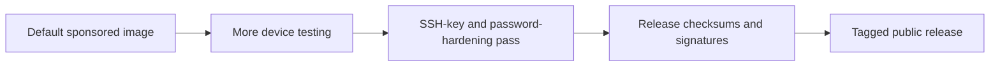

## Development Status

Current milestone:

```text
Sponsored-image line boots Arch Linux ARM from /dev/sda17 with display, touch,
USB networking, Wi-Fi, Bluetooth audio, mobile data, loudspeaker, earpiece,
sensors, and Hyprland auto-rotate working on the prototype.
```

Next milestone:

```text
Keep the stable kernel path boring and repeatable, while using the explicit
camera kernel track for IMX519 and sensor testing on lab devices.
```

## Project Direction

This repo is the practical installer/build side of the broader Linux phone
project. The bigger product goal is a stable Linux smartphone platform with
good touch UX, desktop convergence, USB-C dock workflows, and a transparent
community build process.

The OnePlus 6T is the proving ground before future hardware claims. Its USB-C
connector is limited to USB 2.0, so future flagship hardware must provide USB
3.x and DisplayPort Alt Mode for credible low-latency docking, gaming, and
multiple external displays.

The first usable phone and SMS apps are shipped as Arch packages:

```text
gnome-calls
chatty
feedbackd
```

Future phone UI work should stay reusable over ModemManager, PipeWire, and
D-Bus so the shell can remain replaceable.

## Licence And Notices

This repository is source-available under a custom licence for the
Toni McQueen-authored project material:

```text
O6T-LINUX-1.0
```

O6T-LINUX-1.0 is adapted from the BOOTY-1.1 Booty Original Ownership Terms and
Yield-Back Licence model.

That licence covers the original installer scripts, build glue, profile glue,
project documentation, and project-owned assets, except where a file or notice
states otherwise. It is **not** an Open Source Initiative approved open-source
licence because it contains non-commercial-use and mandatory share-back terms.

Every source or binary redistribution of the Toni McQueen original project
material must retain:

```text
LICENSE
```

```text
NOTICE
```

```text
docs/THIRD-PARTY-NOTICES.md
```

Third-party components keep their own licences. This project does not relicense
kernel materials, postmarketOS-derived boot inputs, firmware, Arch Linux ARM
packages, vendor source trees, libraries, ALSA UCM files, or any other
third-party material. Those pieces are documented in
`docs/THIRD-PARTY-NOTICES.md` where the repo carries them directly.

## Help Fund The Next Linux Phone

The OnePlus 6T proves the idea on affordable hardware: real Arch Linux ARM,
real Wayland, real phone services, real fastboot installs, and enough working
hardware to show that a Linux phone does not have to be a locked-down toy.

Now the quest marker moves.

```text
+------------------------------------------+
| TARGET ACQUIRED: FAIRPHONE 5             |
| Status: next-stage Linux phone research  |
| Mission: 1080p portable PC in pocket     |
+------------------------------------------+
```

All donations go toward helping fund the next Linux phone target:
**Fairphone 5**. That means hardware, parts, hosting, testing time,
documentation, and the engineering work needed to push this from a working
OnePlus 6T proof into a more capable Linux phone stack.

Why Fairphone 5 is the next target:

- **Display-out dream:** Fairphone 5-class USB-C 3.0 display support points
  toward a real portable PC in your pocket. The research target is at least a
  1920x1080p external desktop: plug into a monitor, keyboard, mouse, dock,
  hotel TV, or borrowed screen and carry your desktop anywhere.
- **5th generation mobile networks:** 5G support gives the project a better
  modem target for faster mobile internet and modern carrier testing.
- **AI acceleration path:** the Qualcomm QCM6490 platform includes Qualcomm AI
  Engine / Hexagon acceleration, giving future builds better hardware to test
  local AI-assisted phone workflows.
- **Better graphics target:** Adreno 643-class graphics gives more headroom for
  Wayland, desktop effects, video, games, docks, and GPU experiments.
- **Repairability is designed in:** Fairphone is built around replaceable parts,
  including practical repair paths for battery, display, USB-C, cameras, and
  other modules, which matters when development hardware gets used hard.
- **More testing headroom:** newer hardware gives more space to push audio,
  modem, camera, suspend, display-out, and desktop convergence work.

This repository does **not** install to Fairphone 5 today. It is a OnePlus 6T
installer. Fairphone 5 is the next-stage development target: prove the software
stack here, then fund the hardware and engineering time needed to move the
dream forward.

Please pay me at least a $1+ please if this project helped you, or if you want
to help fund the next stage of Linux phone development.

```text
https://tonimcqueen.com/pay/
```

GoFundMe backup funding link:

```text
https://gofund.me/283160597
```

For project correspondence, use:

```text
contact@tonimcqueen.com
```

Fairphone 5 reference pages:

```text
https://wiki.postmarketos.org/wiki/Fairphone_5_(fairphone-fp5)
```

```text
https://support.fairphone.com/hc/en-us/articles/18020671537041-Fairphone-5-FAQ
```
